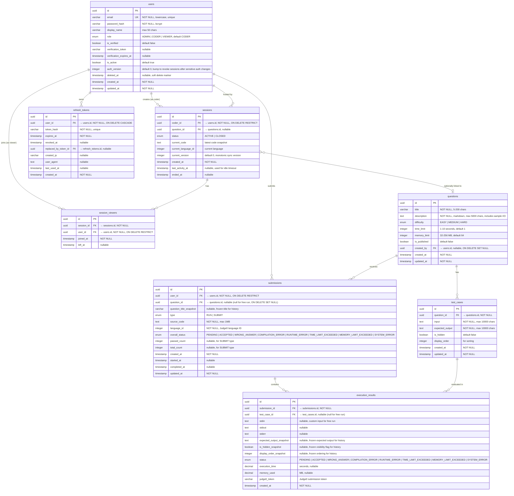

# ENTITY RELATIONSHIP DIAGRAM
## Online Code Editor Platform

**Version:** 2.0  
**Date:** March 2026  
**Status:** Ready for Review

---

## 1. ER DIAGRAM



---

## 2. TABLE DEFINITIONS

### 2.1 `users`

Stores all registered accounts. Role determines access level across the platform.
Admin delete is implemented as a soft delete (`deleted_at`, `is_active=false`) so history and FK integrity are preserved.

| Column | Type | Constraints | Description |
|--------|------|-------------|-------------|
| `id` | UUID | PK, default gen_random_uuid() | Primary key |
| `email` | VARCHAR(255) | UNIQUE, NOT NULL | Normalized to lowercase |
| `password_hash` | VARCHAR(255) | NOT NULL | bcrypt hash (salt rounds ≥ 10) |
| `display_name` | VARCHAR(50) | nullable | Display name |
| `role` | ENUM | NOT NULL, default `'CODER'` | `ADMIN` \| `CODER` \| `VIEWER` |
| `is_verified` | BOOLEAN | NOT NULL, default `false` | Email verification status |
| `verification_token` | VARCHAR(255) | nullable | Token for email verification |
| `verification_expires_at` | TIMESTAMP | nullable | Token expiry (24h from creation) |
| `is_active` | BOOLEAN | NOT NULL, default `true` | Account lock status |
| `auth_version` | INTEGER | NOT NULL, default `0` | Increment to invalidate old access tokens after password/role/security changes |
| `deleted_at` | TIMESTAMP | nullable | Logical delete timestamp |
| `created_at` | TIMESTAMP | NOT NULL, default NOW() | Registration time |
| `updated_at` | TIMESTAMP | NOT NULL, default NOW() | Last profile update |

**Indexes:**
- `UNIQUE INDEX idx_users_email ON users(email)`
- `INDEX idx_users_role ON users(role)`
- `INDEX idx_users_verification_token ON users(verification_token)` — for email verification lookup
- `INDEX idx_users_deleted_at ON users(deleted_at)`

**User Story Mapping:** US01, US02, US03

---

### 2.2 `questions`

Admin-managed coding problems. Only `is_published = true` questions are visible to Coder/Viewer.

| Column | Type | Constraints | Description |
|--------|------|-------------|-------------|
| `id` | UUID | PK | Primary key |
| `title` | VARCHAR(200) | NOT NULL | Question title (5-200 chars) |
| `description` | TEXT | NOT NULL | Markdown body (max 5000 chars). Includes sample input/output embedded as markdown code blocks |
| `difficulty` | ENUM | NOT NULL | `EASY` \| `MEDIUM` \| `HARD` |
| `time_limit` | INTEGER | NOT NULL, default `1` | Seconds (1-10) |
| `memory_limit` | INTEGER | NOT NULL, default `64` | MB (32-256) |
| `is_published` | BOOLEAN | NOT NULL, default `false` | Visibility flag |
| `created_by` | UUID | FK → users.id, nullable, ON DELETE SET NULL | Author (admin) |
| `created_at` | TIMESTAMP | NOT NULL | Creation time |
| `updated_at` | TIMESTAMP | NOT NULL | Last edit time |

**Indexes:**
- `INDEX idx_questions_published ON questions(is_published)`
- `INDEX idx_questions_difficulty ON questions(difficulty)`

**User Story Mapping:** US10

---

### 2.3 `test_cases`

Input/output pairs for auto-grading. Hidden test cases are used for grading but their expected output is never exposed to Coder/Viewer.

| Column | Type | Constraints | Description |
|--------|------|-------------|-------------|
| `id` | UUID | PK | Primary key |
| `question_id` | UUID | FK → questions.id, NOT NULL, ON DELETE CASCADE | Parent question |
| `input` | TEXT | NOT NULL | Test input (max 10,000 chars) |
| `expected_output` | TEXT | NOT NULL | Expected output (max 10,000 chars) |
| `is_hidden` | BOOLEAN | NOT NULL, default `false` | If true, output hidden from coder |
| `display_order` | INTEGER | NOT NULL, default `0` | Sort order |
| `created_at` | TIMESTAMP | NOT NULL | Creation time |
| `updated_at` | TIMESTAMP | NOT NULL | Last edit time |

**Indexes:**
- `INDEX idx_test_cases_question ON test_cases(question_id)`

**Constraints:**
- ON DELETE CASCADE from `questions` — deleting a question removes all its test cases

**User Story Mapping:** US11

---

### 2.4 `submissions`

The **parent record** for both free runs and graded submits. Stores the source code **once**.

| Column | Type | Constraints | Description |
|--------|------|-------------|-------------|
| `id` | UUID | PK | Primary key |
| `user_id` | UUID | FK → users.id, NOT NULL, ON DELETE RESTRICT | Who submitted |
| `question_id` | UUID | FK → questions.id, nullable, ON DELETE SET NULL | NULL for free run, set for submit |
| `question_title_snapshot` | VARCHAR(200) | nullable | Frozen question title for history after question edits/deletes |
| `type` | ENUM | NOT NULL | `RUN` \| `SUBMIT` |
| `source_code` | TEXT | NOT NULL | Code snapshot (max 1MB) |
| `language_id` | INTEGER | NOT NULL | Judge0 language ID |
| `overall_status` | ENUM | NOT NULL, default `'PENDING'` | Aggregated status |
| `passed_count` | INTEGER | nullable | Test cases passed (SUBMIT only) |
| `total_count` | INTEGER | nullable | Total test cases (SUBMIT only) |
| `created_at` | TIMESTAMP | NOT NULL | Submission time |
| `started_at` | TIMESTAMP | nullable | When execution/grading actually began |
| `completed_at` | TIMESTAMP | nullable | When execution/grading finished |
| `updated_at` | TIMESTAMP | NOT NULL | Last status change time |

**Enums for `overall_status`:**

| Value | Meaning |
|-------|---------|
| `PENDING` | Queued / executing |
| `ACCEPTED` | All test cases passed (or run output received) |
| `WRONG_ANSWER` | Some test cases failed |
| `COMPILATION_ERROR` | Code failed to compile |
| `RUNTIME_ERROR` | Runtime crash (segfault, etc.) |
| `TIME_LIMIT_EXCEEDED` | Exceeded time limit |
| `MEMORY_LIMIT_EXCEEDED` | Exceeded memory limit |
| `SYSTEM_ERROR` | Judge0 down / internal error |

**Indexes:**
- `INDEX idx_submissions_user ON submissions(user_id, created_at DESC)` — user history listing
- `INDEX idx_submissions_question ON submissions(question_id)` — filter by question
- `INDEX idx_submissions_status ON submissions(overall_status)` — filter by status
- `INDEX idx_submissions_type ON submissions(type)` — separate RUN vs SUBMIT queries
- `INDEX idx_submissions_created_at ON submissions(created_at DESC)` — admin timeline queries

**How it works:**

| Scenario | `type` | `question_id` | `passed_count` / `total_count` | `execution_results` count |
|----------|--------|---------------|-------------------------------|--------------------------|
| User clicks **Run** with custom input | `RUN` | `NULL` | `NULL` / `NULL` | **1** (custom stdin) |
| User clicks **Run** on a question page | `RUN` | set (optional) | `NULL` / `NULL` | **1** (custom stdin) |
| User clicks **Submit** against question | `SUBMIT` | set (required) | e.g. `5` / `8` | **N** (1 per test case) |

**Lifecycle fields:**
- `created_at`: request accepted and submission row created
- `started_at`: worker begins execution
- `completed_at`: final result available
- `updated_at`: latest state transition

**User Story Mapping:** US06, US09, US12

---

### 2.5 `execution_results`

Individual execution results. One row per run against custom input or per test case.

| Column | Type | Constraints | Description |
|--------|------|-------------|-------------|
| `id` | UUID | PK | Primary key |
| `submission_id` | UUID | FK → submissions.id, NOT NULL, ON DELETE CASCADE | Parent submission |
| `test_case_id` | UUID | FK → test_cases.id, nullable | NULL for free run (custom input) |
| `stdin` | TEXT | nullable | Custom input (free run only, max 100KB) |
| `stdout` | TEXT | nullable | Program output (max 100KB) |
| `stderr` | TEXT | nullable | Error output |
| `status` | ENUM | NOT NULL, default `'PENDING'` | Same enum as `overall_status` |
| `execution_time` | DECIMAL(10,4) | nullable | Seconds |
| `memory_used` | DECIMAL(10,2) | nullable | MB |
| `judge0_token` | VARCHAR(255) | nullable | Judge0 submission token for callback/webhook correlation |
| `created_at` | TIMESTAMP | NOT NULL | Execution time |
| `expected_output_snapshot` | TEXT | nullable | Frozen expected output for historical grading detail |
| `is_hidden_snapshot` | BOOLEAN | nullable | Frozen hidden/public flag |
| `display_order_snapshot` | INTEGER | nullable | Frozen display order |

**Indexes:**
- `INDEX idx_exec_results_submission ON execution_results(submission_id)`
- `INDEX idx_exec_results_test_case ON execution_results(test_case_id)`
- `UNIQUE INDEX idx_exec_results_judge0_token ON execution_results(judge0_token)` — idempotent Judge0 callback/webhook correlation

**Relationship Rules:**
- If `type = RUN` → exactly **1** execution_result with `test_case_id = NULL`, `stdin = custom input`
- If `type = SUBMIT` → **N** execution_results with `test_case_id = set`, `stdin = NULL` (input comes from test_case)
- Historical detail reads from snapshot columns, not live `test_cases` rows

**User Story Mapping:** US06, US07, US12, US12.1

---

### 2.6 `sessions`

Realtime coding sessions. Coder creates, Viewers join. Stores latest code snapshot for late-joining viewers.

| Column | Type | Constraints | Description |
|--------|------|-------------|-------------|
| `id` | UUID | PK | Session ID (shared as join link) |
| `coder_id` | UUID | FK → users.id, NOT NULL, ON DELETE RESTRICT | Session host |
| `question_id` | UUID | FK → questions.id, nullable | Linked question (optional) |
| `status` | ENUM | NOT NULL, default `'ACTIVE'` | `ACTIVE` \| `CLOSED` |
| `current_code` | TEXT | nullable | Latest code snapshot for sync |
| `current_language_id` | INTEGER | nullable | Current language in editor |
| `current_version` | INTEGER | NOT NULL, default `0` | Latest applied sync version for ordering and recovery |
| `created_at` | TIMESTAMP | NOT NULL | Session start |
| `last_activity_at` | TIMESTAMP | nullable | Updated on coder change/run/submit for idle close policy |
| `ended_at` | TIMESTAMP | nullable | Session end (when closed) |

**Indexes:**
- `INDEX idx_sessions_coder ON sessions(coder_id)`
- `INDEX idx_sessions_status ON sessions(status)`

**Lifecycle:**
1. Coder creates → `status = ACTIVE`
2. Viewers join via link
3. `last_activity_at` tracked from realtime/editor activity
4. Coder disconnects → auto-close after 5 min idle
5. Coder clicks "End Session" → `status = CLOSED`, `ended_at = NOW()`

**User Story Mapping:** US14

---

### 2.7 `session_viewers`

Join table tracking which viewers are/were in a session. Supports viewer count and history for public-by-link sessions.

| Column | Type | Constraints | Description |
|--------|------|-------------|-------------|
| `id` | UUID | PK | Primary key |
| `session_id` | UUID | FK → sessions.id, NOT NULL, ON DELETE CASCADE | Session |
| `user_id` | UUID | FK → users.id, NOT NULL, ON DELETE RESTRICT | Viewer |
| `joined_at` | TIMESTAMP | NOT NULL | When viewer joined |
| `left_at` | TIMESTAMP | nullable | When viewer left (NULL = still watching) |

**Indexes:**
- `UNIQUE INDEX idx_session_viewer_active ON session_viewers(session_id, user_id) WHERE left_at IS NULL` — one active join per viewer
- `INDEX idx_session_viewers_session ON session_viewers(session_id)`

**User Story Mapping:** US14.1

---

### 2.8 `refresh_tokens`

Stores hashed rotating refresh tokens used for remember-session flows.

| Column | Type | Constraints | Description |
|--------|------|-------------|-------------|
| `id` | UUID | PK | Primary key |
| `user_id` | UUID | FK → users.id, NOT NULL, ON DELETE CASCADE | Token owner |
| `token_hash` | VARCHAR(255) | UNIQUE, NOT NULL | Hash of opaque refresh token |
| `expires_at` | TIMESTAMP | NOT NULL | Expiry time |
| `revoked_at` | TIMESTAMP | nullable | Revocation time |
| `replaced_by_token_id` | UUID | FK → refresh_tokens.id, nullable | Rotation chain |
| `created_ip` | VARCHAR(64) | nullable | Source IP at issuance |
| `user_agent` | TEXT | nullable | Client user agent |
| `last_used_at` | TIMESTAMP | nullable | Last refresh time |
| `created_at` | TIMESTAMP | NOT NULL | Issue time |

**Indexes:**
- `UNIQUE INDEX idx_refresh_tokens_hash ON refresh_tokens(token_hash)`
- `INDEX idx_refresh_tokens_user ON refresh_tokens(user_id)`
- `INDEX idx_refresh_tokens_expiry ON refresh_tokens(expires_at)`

**Rules:**
- Refresh tokens are opaque and stored hashed
- On refresh success, old token is revoked and replaced by a new token
- On detected token reuse, all active refresh tokens for the user are revoked

**User Story Mapping:** US02

---

## 2.9 Delete Behavior

User-linked historical records are preserved by default:
- Admin delete is a logical delete on `users`, not a physical row removal
- `submissions.user_id`, `sessions.coder_id`, and `session_viewers.user_id` use `ON DELETE RESTRICT` for physical deletes
- `questions.created_by` uses `ON DELETE SET NULL` because authored questions may outlive the admin account
- `refresh_tokens.user_id` uses `ON DELETE CASCADE` for maintenance-time hard deletes

---

## 3. LANGUAGE ID MAPPING (Reference)

Reference table for the `language_id` field (not stored in DB — hardcoded/config):

| Language | Judge0 ID |
|----------|-----------|
| C | 50 |
| C++ | 54 |
| C# | 51 |
| Java | 62 |
| JavaScript | 63 |
| TypeScript | 74 |
| Python | 71 |
| PHP | 68 |
| Dart | 90 |

---

## 4. KEY DESIGN DECISIONS

### 4.1 Why `submissions` + `execution_results` (not a single flat table)?

| Concern | Single Table | Two Tables (chosen) |
|---------|-------------|-------------------|
| Code duplication | Code stored N times (once per test case) | Code stored **once** in `submissions` |
| Free run vs submit | Awkward `type` field with many nullable columns | Clean separation: `RUN` has 1 result, `SUBMIT` has N |
| History query | Need GROUP BY to aggregate | Simple query on `submissions` table |
| Detail view | Already have everything | JOIN to `execution_results` when needed |

### 4.2 Why `question_id` is nullable on `submissions`?

A free **Run** doesn't require a question — the user just wants to test code with custom input. Making `question_id` nullable allows:
- Free run from the editor (no question context)
- Free run on a question page (question_id set for reference, but not graded)
- Submit always requires question_id

### 4.3 Why `stdin` is on `execution_results` (not `submissions`)?

For a **Run**, the custom input belongs to the individual execution. For a **Submit**, each test case has its own input (from `test_cases.input`). Keeping `stdin` on `execution_results` makes both cases consistent.

### 4.4 Why `current_code` on `sessions`?

When a viewer joins late, they need the latest code snapshot. Instead of replaying all WebSocket events, the server stores the latest snapshot in `sessions.current_code` and sends it on join.

---

## 5. EXAMPLE DATA FLOWS

### Flow 1: Free Run (Click "Run")
```
1. INSERT submissions (type=RUN, question_id=NULL, source_code=..., language_id=71)
2. Send to Judge0 → get token
3. INSERT execution_results (submission_id=..., test_case_id=NULL, stdin="5 10", judge0_token=...)
4. Judge0 callback/webhook returns result
5. UPDATE execution_results (stdout="15", status=ACCEPTED, execution_time=0.05)
6. UPDATE submissions (overall_status=ACCEPTED)
7. Emit WebSocket event `execution_completed`
```

### Flow 2: Submit (Click "Submit")
```
1. INSERT submissions (type=SUBMIT, question_id=q1, source_code=..., language_id=71)
2. Fetch test_cases WHERE question_id=q1 → [tc1, tc2, tc3, tc4, tc5]
3. For EACH test case:
   a. Send to Judge0 (stdin = test_case.input) → get token
   b. INSERT execution_results (submission_id=..., test_case_id=tc.id, judge0_token=...)
4. Judge0 callback/webhook returns results for all tokens
5. UPDATE each execution_results (stdout, status, time, memory)
6. Compare: actual_output vs test_case.expected_output
7. Aggregate: passed_count=4, total_count=5
8. UPDATE submissions (overall_status=WRONG_ANSWER, passed_count=4, total_count=5)
9. Emit WebSocket events `grading_progress` and `grading_completed`
```

---

**Document Owner:** Project Team  
**Last Updated:** March 2026  
**Review Date:** TBD
