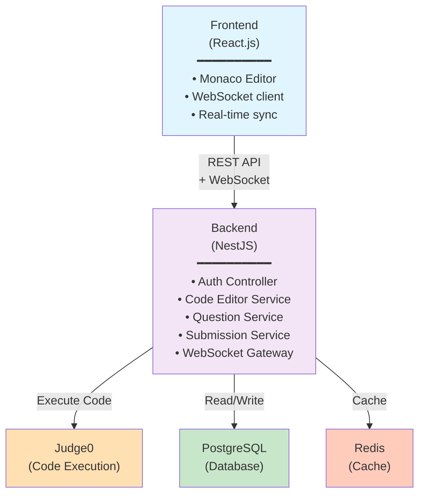

# REQUIREMENT DOCUMENT
## Online Code Editor Platform

**Project Name:** Online Code Editor  
**Version:** 2.0  
**Date:** March 2026  
**Status:** In Progress

---

## 1. EXECUTIVE SUMMARY

Platform cho phép người dùng viết code online với nhiều ngôn ngữ lập trình, thực thi code trong môi trường sandbox an toàn, hỗ trợ collaboration realtime, và quản lý câu hỏi/test case tự động chấm.

---

## 2. PROJECT SCOPE

### 2.1. Scope of Work (Công việc cần làm)

| In Scope ✅ | Out of Scope ❌ |
|---|---|
| Thiết kế hệ thống (ERD, API spec, C4) | Hạ tầng production (AWS, domain, SSL) |
| Phát triển Frontend & Backend | Bảo trì sau MVP |
| Kiểm thử & QA | Hỗ trợ kỹ thuật 24/7 |
| Demo | Ứng dụng Mobile |
| Setup local deployment (Docker) | Multi-region |

---

### 2.2. Functional Scope (Features)

| Functional Requirements | Non-Functional Requirements |
|---|---|
| F1-F10: Code editor, execution, realtime, questions, auth, history, dashboard | NFR1-NFR9: Isolation, latency, concurrency, performance targets |

---

### 2.3. Deliverables (Output cụ thể)

- **Source Code** - Frontend + Backend repo
- **Design Docs** - ERD, API spec, C4 diagram
- **Test Evidence** - Unit, Integration, E2E, Security test reports
- **Deployment Manual** - Docker, Database setup guide
---

## 3. STAKEHOLDER

| Stakeholder | Role | Responsibility |
|-------------|------|----------------|
| Project Supervisor | Project oversight | Định hướng mục tiêu dự án, review requirement document và đánh giá kết quả demo. |
| Project Team | System development | Thiết kế, triển khai và tích hợp các thành phần của hệ thống như frontend, backend, realtime sync và code execution. |
| End Users (Coder / Viewer) | Platform users | Sử dụng hệ thống để viết code, chạy chương trình và cung cấp feedback về trải nghiệm sử dụng. |

## 4. FUNCTIONAL REQUIREMENTS

| ID | Requirement | Description |
|----|-------------|-------------|
| **F1** | Code Editor | Web-based editor (Monaco) với syntax highlight cho 9 ngôn ngữ. Support chọn ngôn ngữ từ dropdown. |
| **F2** | Code Execution | User click **Run/Submit** → backend tạo submission async, gửi code đến Judge0, trả về `submission_id` ngay và client nhận tiến trình/kết quả qua WebSocket. Cả `RUN` và `SUBMIT` đều được lưu để phục vụ history/audit, nhưng chỉ `SUBMIT` được tính là bài nộp chính thức theo câu hỏi. |
| **F3** | Realtime Sync | Coder gõ code → Viewer thấy live realtime (1 chiều, debounce 300ms) |
| **F4** | Question Management | Admin tạo/sửa/xóa câu hỏi (title, description markdown; sample input/output được nhúng trong description) |
| **F5** | Test Case Management | Admin tạo hidden test case, hệ thống auto-compare output vs expected |
| **F6** | User Registration | User đăng ký email/password, email verification |
| **F7** | User Login | Login với access token + refresh token rotation để support remember session |
| **F8** | Role Assignment | Admin gán role (Admin/Coder/Viewer) cho user |
| **F9** | Execution History | Lưu & display history cho cả `RUN` và `SUBMIT`: question, type, code, language, status, execution time, memory, timestamp |
| **F10** | Admin Dashboard & Execution Controls | Xem tất cả submission, filter by user/question/date, và cấu hình giới hạn số lần `Run` theo từng user |

---

## 5. NON-FUNCTIONAL REQUIREMENTS

| ID | Requirement | Target |
|----|-------------|--------|
| **NFR1** | Isolation | Code user A không truy cập file/process user B (Judge0 container sandbox) |
| **NFR2** | Resource Limit | Execution time max 10s, Memory max 256MB |
| **NFR3** | Concurrency | Hỗ trợ ≥10 concurrent submissions, queue nếu vượt; nếu hàng đợi đã đầy thì trả về `503 Service Unavailable` với thông báo rõ ràng, không được drop request silently |
| **NFR4** | Response Time | Non-execution API response < 500ms; execution create endpoints (`POST /run`, `POST /submit`) < 500ms vì chỉ enqueue và trả `submission_id`; async execution/grading completion và polling/read-result APIs không thuộc SLA 500ms; page load < 2s |
| **NFR5** | Realtime Latency | Sync delay < 1 giây |
| **NFR6** | Security | Sandbox chặn fork/network call, JWT auth, HTTPS |
| **NFR7** | Availability | Judge0 down → hiển thị error rõ ràng, auto-retry, không crash system |
| **NFR8** | Database ACID | PostgreSQL transactions, data consistency |
| **NFR9** | Session Continuity | Realtime session giữ trạng thái tối đa 5 phút sau khi coder disconnect; nếu coder reconnect trước timeout thì session tiếp tục, quá 5 phút thì auto-close |

---

## 6. USER ROLES & PERMISSIONS
**Use Case:** Coder stream code, Viewer (interviewer) chỉ xem realtime
**Ký hiệu:** ✅ (Được phép) | ❌ (Từ chối) | ⚠️ (Có điều kiện)

| Nhóm Tài Nguyên | Hành động | Coder | Viewer | Admin |
|---|---|:---:|:---:|:---:|
| **Authentication / Account** | Đăng ký tài khoản | ✅ | ✅ | ❌ |
| | Đăng nhập / Đăng xuất | ✅ | ✅ | ✅ |
| | Xem hồ sơ cá nhân của chính mình | ✅ | ✅ | ✅ |
| | Cập nhật hồ sơ cá nhân của chính mình | ✅ | ✅ | ✅ |
| **Code Editor / Session** | Tạo phiên code mới | ✅ | ❌ | ✅ |
| | Chỉnh sửa code trong editor | ✅ | ❌ | ✅ |
| | Chọn ngôn ngữ lập trình | ✅ | ❌ | ✅ |
| | Xem code đang được viết realtime | ✅ | ✅ | ✅ |
| | Tham gia session với quyền chỉ xem (qua link) | ❌ | ✅ | ✅ |
| **Code Execution** | Chạy code (Run) | ✅ | ❌ | ✅ |
| | Xem kết quả chạy code của chính mình | ✅ | ❌ | ✅ |
| | Xem kết quả chạy code realtime đang chạy | ⚠️ | ✅ | ✅ |
| | Dừng / hủy execution đang chạy | ⚠️ | ❌ | ✅ |
| **History / Submissions** | Xem lịch sử run / submit của chính mình | ✅ | ❌ | ✅ |
| | Xem chi tiết submission của chính mình | ✅ | ❌ | ✅ |
| | Xem tất cả submissions của tất cả user | ❌ | ❌ | ✅ |
| | Xóa submission | ❌ | ❌ | ✅ |
| **Questions** | Xem danh sách câu hỏi | ✅ | ✅ | ✅ |
| | Xem chi tiết câu hỏi | ✅ | ✅ | ✅ |
| | Tạo câu hỏi mới | ❌ | ❌ | ✅ |
| | Cập nhật câu hỏi | ❌ | ❌ | ✅ |
| | Xóa câu hỏi | ❌ | ❌ | ✅ |
| **Test Cases** | Xem test case mẫu (public/sample) | ✅ | ✅ | ✅ |
| | Xem test case ẩn (hidden) | ❌ | ❌ | ✅ |
| | Tạo / sửa / xóa test case | ❌ | ❌ | ✅ |
| **Users & RBAC** | Xem danh sách user | ❌ | ❌ | ✅ |
| | Khóa / mở khóa tài khoản | ❌ | ❌ | ✅ |
| | Xóa tài khoản | ❌ | ❌ | ✅ |
| | Phân quyền (gán role) | ❌ | ❌ | ✅ |
| **System / Monitoring** | Xem dashboard hệ thống | ❌ | ❌ | ✅ |
| | Xem tất cả logs / execution metrics | ❌ | ❌ | ✅ |
| | Cấu hình giới hạn số lần `Run` theo user | ❌ | ❌ | ✅ |

---

## Chú thích

**⚠️ Coder xem kết quả realtime:** Chỉ execution/session của chính mình

**⚠️ Coder dừng execution:** Chỉ execution của chính mình

**⚠️ Viewer xem submission:** Chỉ kết quả realtime của session công khai đang theo dõi; không xem full history

---

## 7. TECHNOLOGY STACK

| Layer | Technology | Reason |
|-------|-----------|--------|
| **Frontend** | React.js | Large ecosystem, compatibility tốt với Monaco Editor |
| **Backend** | NestJS | Modular architecture, scalable, async support |
| **Database** | PostgreSQL | Relational data, ACID, support transactions |
| **Code Execution** | Judge0 (Selfhost) | Sandbox sẵn, hỗ trợ 60+ ngôn ngữ, isolated environment |
| **Realtime** | WebSocket (Socket.io) | Full control, low latency |
| **Code Editor** | Monaco Editor | VS Code engine, syntax highlight, free |
| **Auth** | JWT access token + rotating refresh token + bcrypt | Short-lived access token, remember session, secure password hashing |
| **Container** | Docker + Docker Compose | Selfhost Judge0 + app |
| **Cache** (Optional) | Redis | Rate limiting, execution result cache |

---

## 8. SYSTEM ARCHITECTURE

## 9. KEY DESIGN DECISIONS

| Decision | Rationale |
|----------|-----------|
| **Judge0 Selfhost** | Kiểm soát tài nguyên, isolation, cost-effective |
| **WebSocket 1-way sync** | Chỉ cần Coder → Viewer, không cần conflict resolution |
| **JWT + Refresh Token** | Access token ngắn hạn giảm rủi ro lộ token, refresh token rotation hỗ trợ remember session và revoke |
| **PostgreSQL** | ACID compliance, relation data, transaction support |
| **Docker Compose** | Dễ deploy, tất cả trong 1 package (Judge0 + app + DB) |
| **Debounce 300ms** | Cân bằng realtime vs network load |

---

## 10. EDGE CASES
| #  | Edge Case                                                | Nhóm      | Severity    | Ảnh hưởng                                                |
| -- | -------------------------------------------------------- | --------- | ----------- | -------------------------------------------------------- |
| 1  | Output có khoảng trắng thừa (trước/sau hoặc dòng trống)  | Execution | 🟡 HIGH     | Có thể bị chấm WA dù logic đúng                          |
| 2  | Sai số số thực (floating point precision)                | Execution | 🟢 LOW      | Chưa áp dụng trong MVP, dùng khi hỗ trợ tolerant judging |
| 3  | Output quá lớn (>100KB)                                  | Execution | 🔴 CRITICAL | Có thể làm hệ thống crash hoặc vượt giới hạn output      |
| 4  | Thời gian chạy sát giới hạn (9.9s vs 10.1s)              | Execution | 🟡 HIGH     | Ảnh hưởng đến tính công bằng khi chấm                    |
| 5  | Event realtime đến sai thứ tự                            | Realtime  | 🔴 CRITICAL | Người xem có thể thấy code bị sai hoặc nhảy dòng         |
| 6  | Event realtime bị gửi lặp                                | Realtime  | 🔴 CRITICAL | Code bị duplicate hoặc hiển thị sai                      |
| 7  | Code giữa client và server bị lệch (checksum không khớp) | Realtime  | 🟡 HIGH     | Code hiển thị không đồng bộ                              |
| 8  | Mất kết nối mạng trong ~30s                              | Realtime  | 🟡 HIGH     | Có thể mất một số update                                 |
| 9  | Người dùng submit nhiều lần cùng lúc (spam click)        | Database  | 🔴 CRITICAL | Thống kê submission bị sai                               |
| 10 | Race condition khi Judge0 callback                       | Database  | 🔴 CRITICAL | Có thể tạo submission trùng hoặc bị mất                  |
| 11 | JWT bị chỉnh sửa (tampered signature)                    | Auth      | 🔴 CRITICAL | Có thể bypass authentication                             |
| 12 | Viewer cố gắng chỉnh sửa code                            | Realtime  | 🔴 CRITICAL | Vi phạm bảo mật                                          |

## 11. USER STORIES
| # | ID | Tên | Epic |
|---|----|----|------|
| 1 | US01 | Đăng Ký Tài Khoản | Auth |
| 2 | US02 | Đăng Nhập | Auth |
| 3 | US03 | Phân Quyền RBAC | Auth |
| 4 | US04 | Web Code Editor | Editor |
| 5 | US05 | Chọn Ngôn Ngữ | Editor |
| 6 | US04.1 | Input/Output Management | Editor |
| 7 | US06 | Chạy Code (Run) | Execution |
| 8 | US07 | Hiển Thị Lỗi | Execution |
| 9 | US12 | Auto-Grading | Execution |
| 10 | US12.1 | Grading Results Display | Execution |
| 11 | US10 | Tạo Câu Hỏi | Content |
| 12 | US11 | Quản Lý Test Cases | Content |
| 13 | US14 | Tạo Coding Session | Collaboration |
| 14 | US14.1 | Join Session (Viewer) | Collaboration |
| 15 | US13 | Code Sync Realtime | Collaboration |
| 16 | US13.1 | Result Sync Realtime | Collaboration |
| 17 | US09 | View Submission History | History |
| 18 | US16 | Admin Dashboard | History |
| 19 | US17 | Sandbox Isolation | Security |
---

## 12. SUCCESS CRITERIA

✅ User đăng ký, verify email, login, refresh session, chọn câu hỏi  
✅ Viết code, click Run/Submit, nhận `submission_id` ngay và theo dõi kết quả async qua WebSocket  
✅ History hiển thị được cả `RUN` và `SUBMIT`, filter theo type/status  
✅ Realtime sync code Coder → Viewer realtime  
✅ Session vẫn giữ được tối đa 5 phút khi coder mất kết nối và tiếp tục nếu reconnect đúng hạn  
✅ Admin tạo test case, auto-grade submission  
✅ Isolation: Code user A không truy cập user B  
✅ 10 concurrent submissions không timeout  

---

**Document Owner:** Project Team  
**Last Updated:** March 2026  
**Review Date:** TBD

